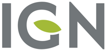

# Rôles entre IGN et ANCT

Par le mandat de 2019, la Direction générale de prévention des risques a confié à l’IGN un rôle de référent national pour le déploiement du PCRS. En réponse à de nouvelles sollicitations, l’Agence nationale de cohésion des territoires s’est intégrée en 2022 au processus par le biais d’une startup d'État. Pour répondre au nécessaire besoin de coordination et éviter une duplication des efforts, ces deux acteurs se sont accordés sur une répartition des tâches là où cela est possible. La grille ci-dessus a pour vocation d’aider une tierce partie qui souhaiterait faire appel spécifiquement à un de ces deux organismes à contacter celui le plus approprié.

<table><thead><tr><th width="84">#</th><th width="379">Activité</th><th width="145">Échelle nationale</th><th>Projet local</th></tr></thead><tbody><tr><td>1</td><td>Appui documentaire et réglementaire à destination des porteurs de projets</td><td></td><td></td></tr><tr><td>2</td><td>Appui technique et partage d’expertise</td><td></td><td></td></tr><tr><td>3</td><td>Appui administratif et financier</td><td>sans objet actuellement</td><td></td></tr><tr><td>4</td><td>Suivi (dév./exploitation) de l’état d’avancement des productions</td><td></td><td></td></tr><tr><td>5</td><td>Appui à la production et à la mise à jour de PCRS</td><td>sans objet</td><td></td></tr><tr><td>6</td><td>Réflexion pour la structuration du cadre national de financement</td><td></td><td></td></tr><tr><td>7</td><td>Agrégation et diffusion nationale des flux</td><td></td><td>sans objet</td></tr><tr><td>8</td><td>Contributions techniques publication / outillage de gestion</td><td></td><td>sans objet</td></tr></tbody></table>

## Détail des actions entreprises

### #1 Appui documentaire et réglementaire à destination des porteurs de projets

#### Échelle nationale

L’ANCT a entrepris de consolider les ressources documentaires (documents, fiches pratiques, comptes rendus, références aux textes légaux) dans [un ensemble cohérent](https://docs.pcrs.beta.gouv.fr/). Il est destiné aux porteurs de projets et à tout acteur souhaitant utiliser le PCRS.

L’ANCT accompagne les porteurs de projets locaux et consolide les retours d’expérience de leur mise en œuvre. Ces éléments permettent de relayer [des questionnements](https://docs.pcrs.beta.gouv.fr/contexte/reglementation/questionnements-reglementaires) sur la réglementation existante et de proposer des évolutions.

#### Projet local

L’ANCT et l’IGN, avec leurs moyens et réseaux différents, prennent en charge et répondent aux questionnements quotidiens des porteurs de projets qui les sollicitent dans le contexte de leur projet local.

Ils participent tous les deux à l’accompagnement pour la compréhension de la réglementation touchant le PCRS, dont les échéances et les acteurs concernés.

### #2 Appui technique et partage d’expertise

#### Échelle nationale

Sous l’égide du[ CNIG](https://cnig.gouv.fr/plan-de-corps-de-rue-simplifie-r21411.html), l’IGN a participé à la définition des spécifications et contribue à la rédaction de[ fiches de recommandations](https://cnig.gouv.fr/fiches-de-recommandations-du-gt-pcrs-a25938.html). L’IGN produit également une partie substantielle du PCRS raster. Lorsqu’il fait appel à ses sous-traitants, cela introduit de facto une harmonisation des méthodes de production et de contrôle en métropole. L’IGN maintient également une page dédiée sur son site[ Géoservices](https://geoservices.ign.fr/pcrs).

#### Projet local

Les [délégués régionaux](https://macarte.ign.fr/carte-narrative/voir/b0839fa088b6b4f34fb1381502190574/Contacts+territoriaux+IGN) de l’IGN servent d’intermédiaire avec les services de production de l’institut. Si sollicités, ils organisent les premières réunions techniques d’information.

### #3 Appui administratif et financier

#### Échelle nationale

Il n’existe pas ou peu d’appui national pour l’obtention de subvention et l’examen de l’adéquation des différentes possibilités. Les animateurs régionaux font par ailleurs une part importante de ce travail pour leurs membres. Il sera possible d’élever cette problématique au niveau national lorsque le besoin s’en fera sentir.

#### Projet local

Par le biais de son réseau de délégués régionaux, l’IGN informe les acteurs locaux des aspects réglementaires et, si sollicités, les aide à réaliser leur PCRS raster (conventionnement, aide au montage de dossier de demande de subvention[ Feder](https://www.europe-en-france.gouv.fr/fr/trouver-une-aide)…).

### #4 Suivi (dév./exploitation) de l’état d’avancement des productions

#### Échelle nationale

L’ANCT a entrepris de définir la modélisation, les outils et [la démarche collaborative](https://docs.pcrs.beta.gouv.fr/suivi-des-projets/demarche) de suivi des projets PCRS pour en constituer la cartographie exhaustive. Elle exploite aujourd’hui la plateforme qui recueille les contributions des porteurs de projet. [Le code](https://github.com/openpcrs/pcrs.beta.gouv.fr) est ouvert et disponible en ligne

#### Projet local

L’ANCT accompagne et rencontre l’ensemble des porteurs de projet pour s’assurer de la prise en main des outils de suivi et garantir l’accès aux agents responsables d’en assurer la complétude.

### #5 Appui à la production et à la mise à jour de PCRS

#### Projet local

L’IGN accompagne les autorités publiques locales compétentes dans la production du PCRS raster en saisie initiale ou en mise à jour. Il peut en résulter, entre autres:

* une production en propre par l’IGN ou via l’accord cadre géré par l’IGN qui permet de solliciter rapidement des opérateurs.&#x20;
* la mise en place d’outils (par exemple outils collaboratifs pour l’identification et la qualification des changements).&#x20;
* l’accompagnement du ou des porteur(s) de projet tout au long du processus dont les contrôles.

### #6 Réflexion pour la structuration du cadre national de financement

#### Échelle nationale

L’ANCT a évalué puis proposé plusieurs scénarios de construction d’un moyen de collecte national des financements des utilisateurs réglementaires du PCRS. Elle contribue avec de nombreux autres acteurs aux réflexions du CNIG sur la question

#### Projet local

L’ANCT conseille également les porteurs de projets dans les changements à prévoir (pas forcément actuellement) dans leur modèle de financement en fonction des orientations en cours d’élaboration. C’est l’occasion d’identifier différents modes de rétribution adverses tels que les contrats de licence qu’il faudra résilier et éventuellement intégrer dans les contributions nationales.

### #7 Agrégation et diffusion nationale des flux

#### Échelle nationale

Conformément au [mandat qui lui a été confié par la DGPR](https://geoservices.ign.fr/sites/default/files/2023-01/IGN_PCRS%20mandat%20DGPR.PDF), L’IGN travaille à la mise en place d’une plateforme nationale de diffusion de l’ensemble des données PCRS disponibles. Cette démarche s’inscrit dans le cadre d’un travail partenarial avec producteurs et utilisateurs du PCRS.

### #8 Contributions techniques publication / outillage de gestion

#### Échelle nationale

Dans la suite des réflexions sur la démarche de suivi, l’ANCT poursuivra ses contributions d’ordre technique auprès des acteurs de l’écosystème, notamment pour la visualisation et la circulation des livrables PCRS entre producteurs et utilisateurs. Cela ne saurait conduire à l’exploitation de services industrialisés, plutôt la proposition de documents ou de codes sources réutilisables par l’écosystème, et cohérents avec la plateforme nationale.
