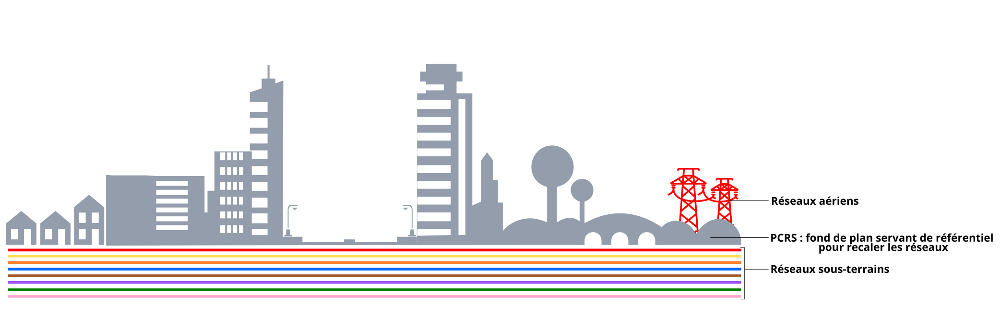

# Réglementation

La réglementation établi les attentes respectives au PCRS d'une part et à l'anti-endommagement d'autre part. Ce ne sont pas les mêmes activités ou produits [mais elles sont étroitement liées](https://www.youtube.com/watch?v=vWneO6kpJxs).

Bien que liés, le PCRS et la réglementation anti-endommagement sont deux composants essentiels et différents de l'intervention (travaux, inspections) auprès des réseaux d'utilités et infrastructures souterraines : le PCRS décrit le corps de rue, sans aucune donnée de réseaux aériens ou souterrains.

<figure><figcaption>
Schéma différenciant les éléments de la réglementation anti-endommagement de ceux du PCRS
</figcaption></figure>

Cette page tente de donner les principaux éléments pour qualifier et comprendre les obligations qui relèvent de l'un ou de l'autre.

## Le PCRS

Le format d'échange PCRS est consacré pour la première fois par l'article 4 de l'arrêté du 22 décembre 2015 modifiant l'article 7 de l'arrêté du 15 février 2012 à partir du 1er janvier 2016. Dans ce cadre, il constitue l'information géographique socle permettant d'affiner la cartographie des réseaux souterrains ou aériens pour limiter le risque d'endommagement à l'occasion de travaux à leurs abords.

Par ailleurs, le PCRS est concerné par les articles L127-1 et suivant du code de l'environnement : c'est un composant de l'infrastructure d'information géographique.

Sans se prémunir d'éventuelles évolutions du format d'échange - nous en sommes déjà à la seconde version en date de septembre 2017 - le principe retenu par l'article 7 (I.7°) de l'arrêté du 15 février 2012 est celui du meilleur lever à grande échelle disponible au moment de la transmission du plan concerné.

La réglementation ne précise pas quel doit être le contenu du PCRS, laissant ce soin aux groupes de travail d'acteurs métiers dont la forme des livrables est certifiée par le CNIG.

### Régime d'obligation

La production du PCRS est déléguée aux collectivités territoriales et non obligatoire. Les textes ne font pas état d'échéances de production particulières.

Lorsque le PCRS est disponible sur le territoire, les gestionnaires de réseaux ont l'obligation à partir du 1er janvier 2026 de l'utiliser dans les réponses aux DT-DICT qu'ils reçoivent (voir ci-dessous). Il s'agit d'ailleurs du seul usage réglementaire connu actuellement.

Nous attirons l'attention de nos lecteurs sur l'esprit de ce cadre : le PCRS est un plan topographique dont les usages dépassent déjà largement l'anti-endommagement pour lequel il a été prévu à l'origine. Les collectivités territoriales les plus avancées font état d'économies importantes en ayant installé le PCRS dans plusieurs services. C'est pour cela que nous parlons d'un [régime incitatif par l'usage](broken-reference).

### Les autorités publiques locales compétentes

L'autorité est maître d'ouvrage de la réalisation du lever grande échelle (ensuite prescrit conforme au format d'échange PCRS le 27 décembre 2016). Elle est mentionnée à l'article 7 de l'arrêté du 15 février 2012 dans sa version initiale.

Le cadre réglementaire ne donne pas de détail supplémentaire et permet à tout EPCI de revendiquer ce titre sur l'emprise de territoire sur lequel il aura réalisé ces levers.

Retrouvez [quelques indications](../../les-projets-pcrs/construction.md#affirmer-le-role-dautorite-publique-locale-competente) pour se déclarer APLC dans le guide de construction des projets.

### Vecteur ou raster

Le contexte réglementaire ne prescrit pas les caractères des campagnes raster ou vecteur, ces spécifications sont adressées par le format d'échange lui-même.

Vous trouverez des éléments utiles à l'arbitrage dans [le guide de construction](../../les-projets-pcrs/construction.md#arbitrer-entre-vectoriel-ou-raster) des projets.

### Échéances

Tout lever grande échelle conforme au format d'échange PCRS préalablement produit par une collectivité devra être utilisé par l'ensemble des gestionnaires de réseaux à partir du **1er janvier 2026**.

Cette échéance est différente du lever des réseaux souterrains détaillé au chapitre suivant et concernant la réglementation anti-endommagement.

Cette date est inscrite dès le 15 février 2012 dans l'article 25 de l'arrêté, sans préconiser le format PCRS inconnu à ce stade. L'arrêté du 26 octobre 2018 modifie cet article 25 en clarifiant l'énoncé et en renforçant sa validité sur tout le territoire national.

### Références Légifrance

* [Articles L127-1 et suivants](https://www.legifrance.gouv.fr/codes/section_lc/LEGITEXT000006074220/LEGISCTA000022936252/) du code de l'environnement
* [Arrêté du 15 février 2012](https://www.legifrance.gouv.fr/jorf/id/JORFTEXT000025391351)
* [Arrêté du 22 décembre 2015](https://www.legifrance.gouv.fr/jorf/id/JORFTEXT000031701569)
* [Arrêté du 27 décembre 2016](https://www.legifrance.gouv.fr/loda/id/LEGIARTI000033839175/2017-01-01/)
* [Arrêté du 26 octobre 2018](https://www.legifrance.gouv.fr/jorf/id/JORFTEXT000037662105)

## Réglementation anti-endommagement

La réglementation anti-endommagement est encadrée par différents arrêtés et décrets qui ont consolidé le fonctionnement du guichet unique [construire sans détruire](https://www.reseaux-et-canalisations.ineris.fr/gu-presentation/construire-sans-detruire/teleservice-reseaux-et-canalisations.html) depuis près d'une décennie.

La réduction des risques d'atteinte aux infrastructures souterraines en service passe par l'amélioration de la précision cartographique sur un fond de plan conforme au format d'échange PCRS. Le I.6° de l'article 7 de l'arrêté du 15 février 2012 prescrit la classe A (voir ci-dessous) comme cible, quelle que soit l'infrastructure.

### Des classes de précisions A, B ou C

La précision cartographique est entendue comme l'incertitude maximale de localisation, seuil à ne pas dépasser par les mesures d'écart de position. L'écart est exprimé par rapport aux mesures décrites à l'article 5 de l'arrêté du 16 septembre 2003.

L'article 1 de l'arrêté du 15 février 2012 défini 3 classes de précision cartographique des ouvrages **en service** :

* Classe A : <= 40 cm pour les ouvrages rigides, <= 50 cm pour les ouvrages flexibles et <= 80 cm pour les ouvrages réalisés avant le 1er janvier 2011, dédiés à la circulation de véhicules.
* Classe B : <= 1.5 m quel que soit l'ouvrage
* Classe C : > 1.5 m quel que soit l'ouvrage

Le géoréférencement classe A est obligatoire pour tout nouvel ouvrage construit après le 1er juillet 2012 (article 5)

### Différents périmètres et échéances

D'après l'article 2 de l'arrêté du 26 octobre 2018, entré en vigueur au 1er janvier 2020, les exploitants de réseaux sont soumis à 3 échéances différentes suivant la nature de l'infrastructure souterraine exploitée pour son référencement en classe A :

* 1er janvier 2020 : pour les ouvrages souterrains sensibles pour la sécurité présents dans les aires urbaines au sens de l'INSEE.
* 1er janvier 2026 : pour les ouvrages souterrains sensibles pour la sécurité sur l'ensemble du territoire et les ouvrages non sensibles des aires urbaines de l'INSEE.
* 1er janvier 2032 : pour tous les ouvrages souterrains implantés sur l'ensemble du territoire.

Il n'est pas fait mention des ouvrages aériens, néanmoins leur cartographie est exigible par l’exécutant de travaux (R554-26 IV du code de l'environnement) sans contrainte de précision.

Par ailleurs, ces dispositifs ne s'appliquent pas au-delà du rivage de la mer (tel que défini par l'article L2111-4 du code de la propriété), les ouvrages sous-marins d’atterrage ne sont pas concernés.

### Quels ouvrages ?

C'est [l'article R554-2](https://www.legifrance.gouv.fr/codes/article_lc/LEGIARTI000036017345/) du code de l'environnement qui prescrit les ouvrages à déclarer sur le portail anti-endommagement. Nous y trouvons les ouvrages d'utilités (électricité, gaz, eau, télécommunications), les ouvrages de transport d'hydrocarbures, de produits chimiques, calorifuges ou frigorigènes.

Les câbles et canalisations sous-marines au delà du rivage de la mer ne sont pas concernées.

L'article 17 du décret 2017-81 (26 janvier 2017) précise les réserves d'entrée en vigueur pour quelques natures d'infrastructures.

#### De la sensibilité pour la sécurité

Certains ouvrages sont particulièrement traités en vertu de leur caractère sensible pour la sécurité (principalement des intervenants). Ce caractère vise à prévenir de risques importants pour l'intégrité des intervenants et non par rapport au risque d'interruption sur ces ouvrages que représenterait une atteinte (voir le [R554-2 du code de l'environnement](https://www.legifrance.gouv.fr/codes/article_lc/LEGIARTI000036017345)).

Par exemple, un réseau de chauffage urbain par distribution de vapeur est sensible pour la sécurité alors qu'un réseau de distribution d'eau potable ne l'est pas : la vapeur peut gravement brûler toute personne se trouvant à proximité d'une fuite fortuite à l'occasion de travaux.

Des dispositions existent depuis le départ permettant à des exploitants d'ouvrages non sensibles au sens supra de demander leur enregistrement en tant qu'ouvrages sensibles. Cela leur confère alors toutes les prérogatives des ouvrages sensibles (Voir le 2nd alinéa du [R554-7 du code de l'environnement](https://www.legifrance.gouv.fr/codes/article_lc/LEGIARTI000029111744)).

### Les DT/DICT

Ces deux documents différents interviennent à des jalons temporels distincts et sont fournis par des acteurs distincts. Ils matérialisent les interactions entre acteurs dans le cadre des démarches anti-endommagement.

#### Les DT

Une Déclaration de Travaux permet d'établir les interactions entre un projet impliquant des travaux et les réseaux existants, qu'ils soient aériens sensibles ou souterrains.

Concrètement, une demande **du maître d'ouvrage** est adressée aux gestionnaires concernés par l'emprise des travaux à entreprendre. Ils répondent (sous 9 jours aux demandes dématérialisées ou 15 jours aux demandes papier) à cette sollicitation avec des données cartographiques conformes [aux geostandards](../geostandards/) prescrits, notamment le PCRS pour le fond de plan.

#### Investigations complémentaires

Dans le cas où la précision des données de réseaux disponibles contreviendraient aux obligations de précision, l'exploitant du réseau indique au maître d'ouvrage que des investigations complémentaires sont nécessaires pour enrichir cette cartographie. Ces travaux sont à la charge de l'exploitant de réseau.

#### La DICT

Une Déclaration d'Intention de Commencer des Travaux est fournie ensuite à une échéance proche du début des travaux, pour prévenir que les opérations projetées auront finalement lieu.

Elle est réalisée par **l’exécutant des travaux** selon le planning qu'il a convenu avec sa MOA. Les exploitants répondent sous 7 jours pour une déclaration dématérialisée ou 9 jours pour une déclaration papier.

#### De l'usage du PCRS dans les réponses

Les exploitants de réseaux ont l'obligation d'utiliser le PCRS dans la construction des réponses faites aux déclarants de travaux. Ils peuvent pour cela construire eux-même ces réponses ou bien s'accorder les services d'un Prestataire d'Aide à la Déclaration.

**L'utilisation de ce fond de plan ne concerne que les réseaux souterrains** puisque même si certains réseaux aériens, sensibles, doivent apparaître sur la cartographie, il n'est pas nécessaire de donner leur position précise pour que la réponse soit valide. On se référera [au fascicule 1](https://reseaux-et-canalisations.ineris.fr/gu-presentation/userfile?path=/fichiers/Guides_techniques/Fascicule1_en_vigueur_01012020.pdf) précisant l'application des mesures réglementaires.

### Références Légifrance

* [Arrêté du 16 septembre 2003](https://www.legifrance.gouv.fr/jorf/id/JORFTEXT000000794936)
* Arrêté du 15 février 2012
* Décret du 17 juin 2014
* [Arrêté du 22 décembre 2015](https://www.legifrance.gouv.fr/jorf/id/JORFTEXT000031701569)
* Arrêté du 27 décembre 2016
* Décret du 24 octobre 2018
* Arrêté du 26 octobre 2018
* [Article R554-2](https://www.legifrance.gouv.fr/codes/article_lc/LEGIARTI000036017345/) du code de l'environnement
* Article R554-26 du code de l'environnement
